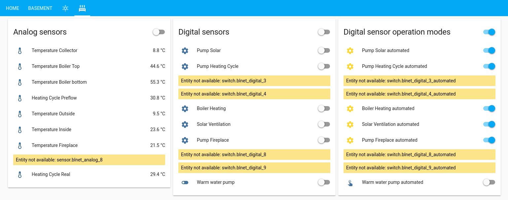

# BLNET custom component for Home Assistant

So there is a freely pogrammable heating controller called [UVR1611 by Technische Alternative](https://www.ta.co.at/en/freely-programmable/uvr1611/). Recently I wanted to have its data displayed in Home Assistant [(already accomplished that once via "UVR1611 Data Logger")](https://community.home-assistant.io/t/hooking-up-the-uvr1611-data-logger-over-wifi/24499). For that you need either the BLNET device or the CLI, in this case some scripts have been developed to assist integrating UVR data via a BLNET device.

For you as a home assistant user, just copy the `custom_component/blnet` file structure into your custom_component directory.

Afterwards, add these lines to your `configuration.yaml`:

      # UVR1611 Data
      blnet:
        resource: your_blnet_address
        password: optional_blnet_password
        can_node: optional_can_bus_node
        use_ta: optional_enforce_use_ta_direct
        scan_interval: optional_scan_interval_seconds

Additional configuration options can be found in the `configurations.yaml` in this repo.

The result:

Customization is fully supported and digital outputs of the UVR1611 can be controlled. Yet from then on you have to create the groups yourself.

At the digital switches, :gear: is displayed if mode of digital output is set to "AUTO", else showing  [mdi:toggle-switch] /  [mdi:toggle-switch-off] 

If you are interested in developing that further feel free to contribute to either this component or the backend python script [pyblnet](https://github.com/nielstron/pyblnet).
