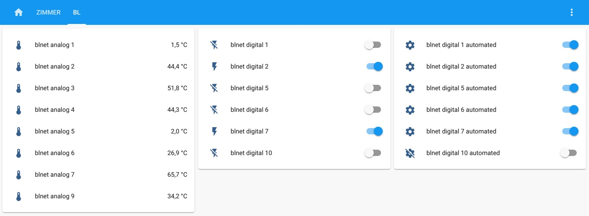

[](https://github.com/custom-components/hacs)

# BLNET custom component for Home Assistant

A custom component to integrate the freely pogrammable heating controller called [UVR1611 by Technische Alternative](https://www.ta.co.at/en/freely-programmable/uvr1611/)
via the BLNET web-interface into home assistant.

## Installation

Add this repository to [hacs](https://hacs.xyz/) or copy the `custom_component/blnet` file structure into your custom_component directory .

Afterwards, add these lines to your `configuration.yaml`:

      # UVR1611 Data
      blnet:
        resource: your_blnet_address
        password: optional_blnet_password
        can_node: optional_can_bus_node
        scan_interval: optional_scan_interval_seconds

There *is* the option to enable usage of the `ta_direct` protocal, which is however not properly working yet.

The result:



## Example configuration

```yaml
# Configuration for the BLNET component
blnet:
  # Host address of your blnet
  resource: http://192.168.255.255
  # Poll interval in seconds (Optional, Default: 360)
  scan_interval: 360
  # Expert access password of the web-interface (Optional, Default: None)
  password: 1234
  # Enable BLNet-Direct access (Broken, Optional, Default: False)
  use_ta: false
  # BLNet-Direct port (Optional, Default: 4000)
  ta_port: 4000
  # Enable Web interface access (Optional, Default: True)
  # When set to false, switches are configured as sensors
  use_web: true
  # Webinterface port (Optional, Default: 80)
  web_port: 80
  # Can-Node to be used (Optional, Default: None - doesn't change the current setting at the BLNET)
  can_node: 20
```

## A few notes

- Customization is fully supported.
- Grouping has to be manually accomplished.
- Digital outputs of the UVR1611 can be controlled via created switch entities.
- __Turning a switch off or on overrides the `AUTO` configuration and sets the switch to `HAND` until it is turned back to `AUTO` manually.__

## Contributions

Feel free to open Pull Requests here or at
the backend python script [pyblnet](https://github.com/nielstron/pyblnet).
